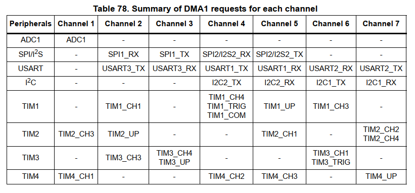

## General stuff

**Note: this guide is totally unfinished!**

**The framework is guaranteed to work with Atollic TrueStudio. Arduino IDE and VS Code have problems and I am yet to find the solution (most likely somewhere deep in the Arduino core files)**

## GPIO

GPIO stands for General Purpose Input/Output and this peripheral on STM32 is roughly the same thing as PORT on Atmega328 (Arduino). That's the thing that drives pins as outputs or inputs. The particular chip present on the Blue Pill (STM32F103C8) has three GPIOs (A, B and C), each can control up to 16 pins, but there are restrictions:

1. GPIOC has only three pins, none of these pins can output current and two of them (PC13 and PC14) are connected to the low-speed external clock source (LSE) and should be left alone (more on that in the RTC chapter). The remaining pin PC13 controls the built-in LED.

2. GPIOA pins PA13, PA14 and PA15, as well as GPIOB pins PB3 and PB4 are used for JTAG/SWD interfaces (used to program and debug the controller). PA13 and PA14 are SWD and there are no pins on the Blue Pill with such names (they are available as SWO and SCLK respectfully in the SWD pinout though). PA15, PB3 and PB4 are JTAG-related and are unavailable after reset. All five can be technically freed for general use, but I don't recommend doing this (especially for the SWD interface). If really needed, the JTAG group can be freeded with `jtag_release()` function after `afio_init()`.

You have 27+1 pins available after reset: PA0 .. PA12, PB0, PB1, PB2, PB5 .. PB15 and PC13 as the built-in LED.

**Output**

Output has two *modes*: push-pull and open-drain. Push-pull is the same as with Arduino: the pin can go either HIGH (3.3V) or LOW (GND). Open-drain often confuses people, although it's pretty simple: here, instead of HIGH, we get a high impedance mode (like INPUT on Arduino). That is, an open-drain pin can either sink current to GND or do nothing and remain invisible to the outside world (circuit). Open-drain mode should be always used with LEDs, as it's better to sink, not source current. In fact, push-pull should never power anything, it's primary use is providing a high signal in communications.

Also, output has variable speed for power saving: 2 MHz, 10 MHz and 50 MHz. 2 MHz is enough for most applications except for some high-speed communication protocols.

Finally, output can be 'alternative function'. This gives control of the pin to some peripheral that needs it. With my library such outputs are setup by the corresponding classes.

**Input**

Input can be floating (high impedance), pulled up and pulled down (the latter unavailable on Arduino). There's also analog mode when the pin is unpowered and unclocked - in fact, all GPIOs are in 'analog mode' when their GPIO clock is disabled

#### Blink.cpp

Let's start with the classic Blink program. We'll use the in-build LED of the Blue Pill that's connected to pin C13. Here's the code:

```cpp
#include <stm32f103_gpio.h>
#include <stm32f103_timers.h>

gpioC_pin led (13);

int main()
{
	gpioC_init();
	led.mode(OUTPUT);
	while(1){
		led.high();
		delay_ms(500);
		led.low();
		delay_ms(500);
	}
}
```

What's happening here?

**1** We include two libraries: one deals with everything GPIO-related, the other works with timers. We need the second one for the `delay_ms` function; it will be covered in more detail later. Technically, it's possible to include just the `ublink.h` header file that'll load all the libraries in this collection, but I use the peripheral libraries names here for better understanding.

**2** We declare an object of the `gpioC_pin` class called `led` and tell the constructor that this object represents pin 13 in the argument `(13)`.

I recommend giving objects names that describe their function (like `led1` and `button2`) instead of their placement (like `pinC13`), as it will make later probable design changes easier. Say, you want to move the LED from one pin to another - you just change the declaration and the code remains pretty readable while dealing with the new pin.

**3** Inside the `main` we initialize GPIOC with `gpioC_init()`, enabling its clock.

**4** We set the pin mode to output, open drain (default), 2MHz (default) using the member function `mode (mode [,cnf])`. Possible `mode` and (optional) `cnf` values are:

|mode|cnf|result|
|---|---|---|
|INPUT| |Default CNF: Floating input|
|INPUT|FLOATING|Floating input|
|INPUT|PULLUP|Input with pullup|
|INPUT|PULLDOWN|Input with pulldown|
|OUTPUT|  |Default CNF: Open-drain otput, default speed 2MHz|
|OUTPUT|OPENDRAIN|Open-drain output, default speed 2MHz|
|OUTPUT|PUSHPULL|Push-pull output, default speed 2MHz|
|OUTPUT2MHZ|_(any)*_|Output speed 2MHz|
|OUTPUT10MHZ|_(any)*_|Output speed 10MHz|
|OUTPUT50MHZ|_(any)*_|Output speed 50MHz|

_*(any) stands for default/empty, OPENDRAIN or PUSHPULL._

So, for example, if we wanted our output to drive the LED Arduino-style (not recommended), we would have used `led.mode(OUTPUT, PUSHPULL)`.

**5** We make the led blink with 500ms intervals inside the endless `while` loop using `high()` and `low()` member functions.

While explicitly setting the pin high and low is ok and very clear, it's possible to make the code shorter with the `invert()` member function:

```cpp
#include <stm32f103_gpio.h>
#include <stm32f103_timers.h>

gpioC_pin led (13);

int main()
{
	gpioC_init();
	led.mode(OUTPUT);
	while(1){
		led.invert();
		delay_ms(1000);
	}
}
```

It's also possible to use the overloaded `=` operator with a `gpio_pin` class object:
* `led = 1;` equals `led.high();`
* `led = 0;` equals `led.low();`

The blink code may look like this:

```cpp
#include <stm32f103_gpio.h>
#include <stm32f103_timers.h>

gpioC_pin led (13);

int main()
{
	gpioC_init();
	led.mode(OUTPUT);
	while(1){
		led = !led;
		delay_ms(100);
	}
}
```

I do not recommend using overloaded operators this way (i.e. `led = !led;`), as it may lead to errors. In this case it works because of the logical NOT operator (`!`), as there's no such overloaded operator declared for the `gpio_pin` class and the compiler implicitly converts the right-hand operand into the available type (uint8_t in this case). More on that shortly.

Finally let's do some input, making the built-in led light up on a button press. Connect the button between ground and a pin. In the example below the pin `button` is PB8, we initialize GPIOB and setup the pin as an input pull-up. Thus the pin will read high when idle and low when the button is pressed. We can access the pin state with `button.read()`, so let's do it the classic way:

```cpp
#include <stm32f103_gpio.h>

gpioC_pin led (13);
gpioB_pin button (8);

int main()
{
	gpioC_init();
	gpioB_init();
	led.mode(OUTPUT);
	button.mode(INPUT, PULLUP);
	while(1){
		if (button.read()) led.high(); else led.low();
	}

```

The `if` statement can be replaced with a simpler line using the overloaded `=` operator:

```cpp
while(1){
		led = button.read();
	}
```

As reading a pin state can be done with overloaded `=`, in *this particular* case it is possible to use even

```cpp
while(1){
		led = button;
	}
```

but that's bad practice. Consider we're using pin PC13 as a temporary output during prototyping and then reconfigure it to pin PB5 with `gpioB_pin led (5);`. Now that both `led` and `button` are of the same `gpioB_pin` class the `=` operator will simply change `led` to `button`. To make the *overloaded* `=` work we'll have to explicitly declare the right hand operand's type:

```cpp
while(1){
		led = (uint8_t)button;
	}
```

That's why I don't recommend using overloads in such situations (although the practice of explicitly stating the desired right-hand type with overloaded operators is rather good).

## PWM Output and Analog Input

While PWM and analog input are both parts of more complex timers and ADC peripherals that will be explained in later chapters, they're present as dedicated functions in the Arduino IDE and traditionally follow the Blink example in manuals. Also, I do have separate classes for quick PWM and ADC usage, so here's a guide to them.

As you may have already guessed, the quickest way to use PWM and analog with my libraries is the overloaded `=` like in

```cpp
int value;
pwm_pin = value;
value = analog_pin;
```

But both are a bit more complex and require some understanding. So let's dig in.

#### PWM pins

Blue Pill has four timers, each provides four PWM channels, so we have 16 PWM pins in all. The table below provides reference to the default mapping of the PWM pins, as we won't go into pin remapping in this tutorial.

Timer channel | Pin
--|--|--
Timer1 Channel 1 | PA8 |
Timer1 Channel 2 | PA9 |
Timer1 Channel 3 | PA10 |
Timer1 Channel 4 | PA11 |
Timer2 Channel 1 | PA0 | 
Timer2 Channel 2 | PA1 | 
Timer2 Channel 3 | PA2 | 
Timer2 Channel 4 | PA3 | 
Timer3 Channel 1 | PA6 | 
Timer3 Channel 2 | PA7 | 
Timer3 Channel 3 | PB0 | 
Timer3 Channel 4 | PB1 |
Timer4 Channel 1 | PB6 |
Timer4 Channel 2 | PB7 |
Timer4 Channel 3 | PB8 |
Timer4 Channel 4 | PB9 |

Now, PWM is a timer's function, or, to be precise, its capture/compare mode's. The timer counts to some value then resets (reloads) and starts again. When it reaches a certain value on it's way to the reload it changes the pin state, and when it reloads it changes it back. That's PWM 101.

The value that the timer reloads at (the auto reload value) is called timer *depth* in this tutorial. The number that forces the output to change is the *compare* value. Don't confuse it with the *duty cycle*, as the latter corresponds to percentage, not a counter value.

So: to start a PWM output you need to set *depth*, then set *compare* somewhere between 0 and *depth*, and we're ready to go? Err, no, not yet. There are six additional options to consider (defaults go first):

1) The counter can run from 0 to *depth* (*upcounter*) **or** backwards (*downcounter*).
2) The counter can be active *until* it reaches the *compare* value **or** become active *when* it reaches the *compare* value. That's called *PWM modes* 1 and 2 respectfully.
3) The ouput can be high **or** low when the counter is *active*. That's *polarity*.
4) PWM can work in *edge-aligned* **or** *center-aligned* mode (known also as *phase-correct* on Atmega). Center-aligned mode is useful for controlling motors.
5) The output pin can work in *open-drain* **or** *push-pull* mode. Again, avoid powering LEDs from the controller, use the default open-drain mode.
6) There is a settable *prescaler* that makes the counter tick slower than its max speed.

The code below uses Timer4 Channel 1, so connect an LEDs cathode to pin PB6 and its anode to 3.3V via a resistor (220 Ohm is ok).

```cpp
#include <stm32f103_gpio.h>
#include <stm32f103_timers.h>

tim4_pwm pwmled(1, 254); // channel, depth

int main()
{
	gpioB_init();
	timer4_init();
	pwmled.pwmMode = 2;
	//pwmled.polarity = 1; // same as changing the mode
	//pwmled.direction = 1; // make the counter count down
	//pwmled.centerMode = 1; // enable center mode
	//pwmled.prescaler = 22; // make the counter 22 times slower (max 0xFFFF)
	//pwmled.depth = 254; // change the depth if it wasn't set before
	pwmled.init();
	pwmled.enable();
	while(1){
		for (uint8_t k = 0; k<255; ++k)
		{
			pwmled = k;
			delay_ms(4);
		}
		for (uint8_t k = 255; k>0; --k)
		{
			pwmled = k;
			delay_ms(4);
		}
	}
}
```

In here we:

**1** Include the needed libraries.

**2** Create a PWM pin object for Timer4 Channel 1 with *depth* set to 254. *Depth* is optional in this constructor (it defaults to 65535), but for the LED dimming I suggest reducing it to 8 bits. *Depth* of 254 instead of 255 guarantees 100% brightness if the *compare* value equals 255, else the LED will turn off for one tick when the counter reaches 255.

**3** In `main()` we initialize (clock) both GPIOB and Timer4 peripherals. Note that you must remember to enable the clocks for all the peripherals you intend to use.

**3** Set the PWM mode to 2, as we want the output to stay low (LED's on) until the counter reaches the *compare* value. Using `pwmled.polarity = 1` here will produce the same result. You can set up other modes too, check the commented out lines of code. Note that here we're just setting the internal class variables, these settings will become active in the next step.

**4** Initialize the PWM pin. This configures the pin and sets up the timer according to our needs (using the settings provided in the previous steps, if any). The pin is configured as Alternate Function Open-Drain by default, if you want to make it a push-pull, add `PUSHPULL` as an argument (`pwmled.init(PUSHPULL)`).

**5** Enable PWM pin output. `disable()` disables the output.

I use the overloaded `=` in the code, but it's possible to `pwmled.write(k);` instead if you prefer the classic C way. There are also additional overloaded operators, namely `++`, `--`, `+=` and `-=`.

### Analog pins

Here's the quick way to get some analog-to-digital readings, I'll cover more ADC details in a later section. Leave the PWM LED where it is and connect a potentiometer to pin PA0. We will control the LEDs brightness with the following code:

```cpp
#include <stm32f103_gpio.h>
#include <stm32f103_timers.h>
#include <stm32f103_adc.h>

tim4_pwm pwmled(1, 0xFFF); // 12 bits
analog_pin pot(0);

int main()
{
	gpioB_init();
	timer4_init();
	pot.init();
	pwmled.pwmMode = 2;
	pwmled.init();
	pwmled.enable();
	while(1){
		pwmled = pot;
	}
}
```
Things of note here:

We increased the `pwmled`'s depth to 12 bits to match the ADC resolution.

The first new line declares an `analog_pin` object as a pin connected to ADC Channel 0 (the argument in brackets). There are ten pins capable of reading an analog signal: PA0..PA7, PB0 and PB1; they correspond to channels 0 to 9 respectfully.

We do not initialize GPIOA, even while we have the pot connected to pin PA0. As noted earlier, the analog mode doesn't require the pin to be clocked. If we use other GPIOA pins for other things, we'll need to initialize it, but the ADC will still work as long as the pin remains in input (default) mode.

When we `init()` the `pot` object, we also initialize (clock) the ADC. If you're interested, I use ADC2 for the `analog_pin` class, as it doesn't support DMA. This `init` is in fact `init(uint8_t cycles = 0)`: it has an optional argument that sets the speed of conversion from `0` (1.5 cycles) to `7` (239.5 cycles); slower means more precise. By default the speed is set to `0` (1.5 cycles).

Lastly, we simply use an overloaded operator to directly changle the PWM value. If you prefer the C way, you can always use the `read()` member function that returns a 16-bit unsigned integer (`pot.read()` in this case).


## Serial communications

Serial input/output allows the microcontroller to communicate with us, making debugging a lot easier. This is done via the USART peripheral of which there are three on the Blue Pill. We will use them in UART mode (asynchronous only). Data is sent (**t**ransmitted) via the TX pin and **r**eceived by the RX pin. Here's the pinout for all three USARTs:

USART | TX | RX 
--|--|--
USART1 | PA9 | PA10 
USART2 | PA2 | PA3 
USART3 | PB10 | PB11

To get the data through to the computer we'll need a USB Serial adapter. There are lots of them available as simple modules based on CP2102, CH340G or whatever chip; they are widely used to program Atmegas. We'll also need a serial monitor program; I use the simple and efficient [CoolTerm](https://freeware.the-meiers.org/).

Connect pins PB10 and PB11 to TX and RX pins of the adapter (the module makers can't agree on the pin markings, so it's TX to TX on some and TX to RX on others; if not sure - just experiment) and connect GND of the adapter to the Blue Pill's GND. Run the serial monitor and set its speed at 9600 baud.

And here's the 'Hello World!':

```cpp
#include <stm32f103_usart.h>

usart3 serial;

int main()
{
	serial.init(9600);
	serial << "Hello World!";
	while(1){}
}
```

Here, we declare a `usart3` object `serial`, initialize it providing the needed baud rate and then send the 'Hello World!' string to it.

I used the standard std.cout/cin syntax here as it's pretty obvious and nice, but there are no streams behind it. That is, both `<<` and `>>` immediately output/input stuff without buffering (there's an additional virtual usart class that writes to memory and resembles stream a bit, but I won't cover it here). Thus it is possible to use both in the same line. Let's do some input-output stuff:

```cpp
#include <stm32f103_usart.h>

usart3 serial;
int val1, val2;

int main()
{
	serial.init(9600);
	serial << "Hi there!\r\n";
	while(1){
		serial << "Enter a number: " >> val1 <<"\r\nEnter another one: " >> val2 << "\r\n";
		serial << "The sum of " << val1 << " and " << val2 << " is " << val1+val2 << "\r\n"; 

	}
}

```

The library converts any integer or floating number into/from a set of characters (not to be confused with a string, as the `<<` and `>>` operators deal with the provided data in different ways depending on the data type, either buffering the result or transferring characters one by one). It is possible to send raw data too, please check the USART library docs for details, there's a lot more functions than described here, but then this is a basic tutorial.

*And here the basic tutorial ends and fun starts.*

## SPI and I2C

SPI and I2C are widely used protocols for communicating with external chips like memory, drivers, etc. My library provides the tools to use these protocols in *master* mode as I don't have any use-cases for the *slave* mode (I do hope to add it in future releases). Unless you intend to build a network of microcontrollers, master mode will cover all your needs.

### SPI

SPI is a fast and simple interface using four lines: data out, data in, clock (CLK) and slave select (SS, also called chip select or CS). When SS goes low the connected slave device knows it's needed and awaits a command. Clock is used to fix the current data line state and transfer one bit: say, data out goes high, then clock goes high, the bit is sent.

While SPI itself is simple, there still is a set of options like clock speed, clock phase and polarity, bit order, data frame format (8-bit or 16-bit), bi- or unidirectional transmission and other stuff. These options are covered in the library manual, in most hobby cases the default mode is enough.

The default mode assumes we're having a full duplex communication (both data out and in are used) at max speed, MSB first, 8-bit data frame, clock is low when idle and the trigger is rising edge. Default also sets the master mode and assumes no one will try to control our microcontroller via SPI, so we won't need the SS *input*, freeing the corresponding pin for other uses (that's called 'software slave select'). SS *input* shouldn't be confused with SS *output*: the latter is used to tell the connected device we want to communicate to it and can be assigned to **any** available pin (including the now freed SS *input*).

Data lines are called MOSI (Master Output Slave Input) and MISO (Master Input Slave Output). As we're using the master mode, they represent data out and data in respectfully.

There are two SPIs on the Blue Pill, and here's the pinout:

Function | Pin
--|--
SPI1 SS | PA4
SPI1 CLK | PA5
SPI1 MOSI | PA6
SPI1 MISO | PA7
SPI2 SS | PB12
SPI2 CLK | PB13
SPI2 MOSI | PB14
SPI2 MISO | PB15

Ok, to show the basics here's a code that controls a DM634 LED driver chip. This code makes 16 LEDs blink: first odd ones, then even ones.

```cpp
#include <stm32f103_spi.h>
#include <stm32f103_gpio.h>
#include <stm32f103_timers.h>

uint16_t leds[17] = {0x0FFF, 0, 0x0FFF, 0, 0x0FFF, 0, 0x0FFF, 0,
					0x0FFF, 0, 0x0FFF, 0, 0x0FFF, 0, 0x0FFF, 0, 0x0FFF};
gpioA_pin lat(4); //SS/Latch signal pin
spi1_slave dm634(&lat);

int main()
{
	gpioA_init(); //init GPIOA
	spi1_init(); //init SPI1
	dm634.init(BIDI_OUTPUT | SOFT_SS | SPIBR8 | DATAFRAME_16); //init and config the object
	dm634.enable(); //enable SPI1 slave
	
	while(1)
	{
		dm634.writeStream(leds, 16); //start transfer normally
		delay_ms(250);
		dm634.writeStream(&leds[1], 16); //start transfer with the second value
		delay_ms(250);
	}
}
```

First, we declare a `gpio_pin` object that will act as an SS signal (or 'latch' as it's called in the DM634 datasheet). Next, we declare a `spi_slave` object and give it a **pointer** to the `gpio_pin` object that we intend to use as SS; from now on the `spi_slave` controls this pin.

Inside `main` we `init` GPIO and SPI1. Then we `init` our `spi_slave` object. In this case we don't use the default values, instead setting it up as: output only, software SS, baud rate divider 8 (fPCLK/8: DM634 max frequency is 16 MHz) and 16-bit data frame, as DM634 has 16-bit resolution. After that, we `enable` the `spi_slave` object. It's not needed in this particular case (`init` also enables SPI), but the `enable` function is useful when you have multiple SPI objects with different configurations on the same SPI bus; `enable` reconfigures SPI according to the settings provided in `init`.

Now, in the loop we send data using `writeStream`, providing it with a **pointer** to a data array and the number of data units (8-bit or 16-bit) to be sent. Note that an array name itself is a pointer, so in the first call to `writeStream` we use just the array name, and in the second call we use a pointer to it's second element, achieving our 16-LEDs animation. If we needed to send just one byte/halfword `dat`, we should have used the `write(dat)` function. And if you want to send, say, three different variables `a`, `b` and `c` to the spi_slave object `obj`, you can use this:

```cpp
obj.ss_low();
obj.writeData(a);
obj.writeData(b);
obj.writeData(c);
obj.ss_high();
```

Here, we manually drive the SS pin low to get the slave's attention, then transfer three variables, then drive the SS pin high, closing communication. Unlike `write`, `writeDat` doesn't manipulate the SS pin.

The DM634 example is rather simple, as we need only to send data with this chip. What about receiving stuff, too?

SPI peripheral in Master mode controls the clock, and the clock in full duplex mode is ticking only when something is being sent. Thus, to receive a byte in Master mode, one has to send a byte, even if there's no need (a dummy byte). There are a number of functions in the library to build up your own way of SPI communication, please check the manual.

For now we'll use a popular Winbond memory chip (that comes in a convenient form of a module) to test the SPI interface. It's W25Q32 to be exact, but any W25 chip will do. Connect MOSI to DI/IO0 of the memory, MISO to DO, CLK to CLK and SS to CS (we again use the freed SS pin for slave select); connect memory's VCC to 3v of the Blue Pill and GND to GND.

```cpp
#include <stm32f103_spi.h>
#include <stm32f103_gpio.h>
#include <stm32f103_usart.h>

gpioA_pin SSpin(4);
spi1_slave flashmem(&SSpin);
usart3 serial;
uint8_t values[3];
uint8_t getJedec = 0x9F;

int main()
{
	gpioA_init();
	spi1_init();
	flashmem.init();
	serial.init(9600);
	flashmem.enable();
	flashmem.seqTransfer(&getJedec, 1, values, 3);
	serial  << "Manufacturer ID: " << values[0] << "\r\n"
		<< "Memory type: " << values[1] << "\r\n"
		<< "Capacity code: " << values[2] << "\r\n";
	while(1){}
}
```

This program returns three values of the JEDEC code, describing the memory chip. It uses the `seqTransfer` function that first sends some data, then receives some data. Generally, SPI devices require some sort of a command (0x9F in this case) to know what exactly is needed from them. For example, to read a flash memory chip you need to send a 'read' command followed by an address. `seqTransfer` works in 8-bit mode only and has four arguments: a **pointer** to the data to be sent, the number of bytes to be sent, a **pointer** to the receiving array or variable, the number of bytes to be received.

To make matters easier, I've made a dedicated library for SPI memory chips: `spi_flashmem.h`. It works with 25-series chips like the popular Winbond models. Here's a demo that will ask for five bytes, write them into flash, then read them back and print:

```cpp
#include <stm32f103_spi.h>
#include <stm32f103_spi_flashmem.h>
#include <stm32f103_gpio.h>
#include <stm32f103_usart.h>

gpioA_pin lat(4);
spi1_slave spifla(&lat);
spi_flash flashmem(&spifla);
usart3 serial;
uint8_t in[5], out[5];

int main()
{
	gpioA_init();
	spi1_init();
	serial.init(9600);
	flashmem.init();

	serial << "Enter five bytes: " >> out[0] >> out[1] >> out[2] >> out[3] >> out[4] << "\r\nErasing...";
	flashmem.erase(100);
	while (flashmem.busy());
	serial << "\r\nWriting...";
	flashmem.write(100, out, 5);
	while (flashmem.busy());
	serial << "\r\nReading...";
	flashmem.read(100, in, 5);
	serial << "\r\nNumbers in the flash: " << in[0] << ", " << in[1] << ", "
			<< in[2] << ", " << in[3] << ", " << in[4] << ".\r\n";

	while(1);
}
```

The `spi_flash` object also gains control of another object, a `spi_slave` one provided as an argument in the constructor. We can `init` the SPI using either object's member function. After that we have four other main `spi_flash` member functions in the code:

`erase(uint32_t addr)` erases a memory sector (4KB) at address `addr`. Flash memory needs to be erased to write new values. Note that it gets erased by sectors of at least 4KB size. Using `addr == 100` in this case we're erasing the first 4KB sector of the flash memory (namely, addresses 0 .. 4095).

`busy()` returns `1` if the flash reports being busy: it's erasing or writing stuff. These actions take some time, so it's a good idea to wait before accessing flash again.

`write(uint32_t addr, uint8_t* arr_out [, uint8_t num = 0])` writes `num` of bytes from the `arr_out` array starting at flash memory location `addr`. If `num` is zero or omitted, a full page (256 bytes) will be written. Note that it's not possible to write into multiple pages with one instruction; if the incoming data goes over the page's end, the extra data will be written at the start of the *same* page. Starting page addresses have eight 0s in the least significant bits (0, 256, 512, 768, etc.).

`read(uint32_t addr, uint8_t* arr_in, uint16_t num)` reads `num` of bytes from the flash address `addr` into the `arr_in` array. Note that there are no page restrictions on reading, thus up to 64KB of data can be read with this member function.

### I2C

I2C is slower than SPI but uses less pins: only data (SDA) and clock (SCL) lines are needed. It's a bit harder to program on the low level, but easier to understand on the high level. I2C also has master-slave roles and again my library deals with the master mode at the moment. You will be able to communicate with simple I2C devices like EEPROM memory, clock chips and other stuff easily.

Here are the I2C pinouts:

* | I2C1 | I2C2
-|-|-
**SCL**| PB6 | PB10
**SDA**| PB7 | PB11

SDA and SCL lines require pull-up resistors. 10k resistors are commonly used, although for faster connections lesser values (2k and even less) are preferred.

In the following examples I'll deal with the Microchip 24LC32A EEPROM memory, but you may use other handy chip. Just connect it to I2C1 (don't forget the resistors!) for the time being.

For starters, let's get the memory's address (I actually forgot it):

```cpp
#include <stm32f103_i2c.h>
#include <stm32f103_usart.h>

usart3 serial;
uint8_t addr;

int main()
{
	i2c1_init(I2C_FM);
	serial.init(9600);
	serial << "Scanning I2C1...\r\n";
	addr = i2c1_scanAddr();
	serial << "Address found: ";
	serial.printHex(addr);
	serial << "\r\n";
	while(1);
}
```

Here we initialize I2C1 in the fast mode (I2C_FM). Fast mode stands for 400 kHz and Standard Mode (I2C_SM) is 100 kHz. Then we use `i2c1_scanAddr` to scan the I2C bus for the first available device and return its address. `i2c1_scanAddr` has an optional `uint8_t` argument that defines the starting address for the search - useful if multiple I2C devices are present.

In my case, I've got `0x55`, so there's my EEPROM. Let's modify the SPI code to test it:

```cpp
#include <stm32f103_i2c.h>
#include <stm32f103_usart.h>
#include <stm32f103_timers.h>

i2c1_slave eeprom(0x55, 12);
usart3 serial;
uint8_t in[5], out[5];

int main()
{
	i2c1_init(I2C_FM);
	i2c1_setFreq(1000000);
	serial.init(9600);

	serial << "Enter five bytes: " >> out[0] >> out[1] >> out[2] >> out[3] >> out[4] << "\r\nWriting...";
	eeprom.writeStream(0x400, out, 5);
	delay_ms(100);
	serial << "\r\nReading...";
	eeprom.readStream(0x400, in, 5);
	serial << "\r\nNumbers in the EEPROM: " << in[0] << ", " << in[1] << ", "
			<< in[2] << ", " << in[3] << ", " << in[4] << ".\r\n";

	while(1);
}
```

First, we declare the `i2c1_slave` object, providing it with the I2C address and optional number of bits of the slave's register addresses (8 is default, up to 16). My EEPROM chip has 12-bit register addresses.

Second, we manually set the I2C bus speed to 1 MHz. Most modern chips can communicate way faster than the 'fast mode', so it's ok to raise the frequency up to 1 or 1.2 MHz, although there's rarely any need to do this. In any case, in here I'm just demonstrating the possibility.

Then we use the `writeStream` member function to write `5` bytes from an array `out` (a pointer) into the eeprom starting at address `0x400`. If we need to write just one byte, we can use `write(uint16_t reg_addr, uint8_t a_byte)` member function; `write16()` and `write32()` will write a halfword and a word respectfully.

*EEPROM note: like flash, EEPROM has it's memory organized in pages, and only one page can be written in a single communication. If a rollover occurs, the data at the start of the page will be overwritten. My EEPROM has 32-byte pages; others may have a different size, check the datasheet.*

After initiating the write we wait 100 ms to make sure EEPROM is accessible again (the chip doesn't have any way to report that it's busy).

Finally, we read the written values back and print them. `readStream` member function follow the same template as the `writeStream`, and `read` functions that return a single value accept just the address as an argument (e.g. `a = eeprom.read(0x400);`).

Finally, let's read some time off a clock module based on DS3231 chip. The code below should print both Clock and Ping 'saying' `0`, then count seconds off the clock chip. The reason I want to do it is the clock chip is battery-powered:

```cpp
#include <stm32f103_i2c.h>
#include <stm32f103_usart.h>
#include <stm32f103_timers.h>

i2c1_slave clock(0x68);
usart3 serial;
uint8_t second;

int main()
{
	serial.init(9600);
	serial << "Clock says: "<< i2c1_resetBus() << "\r\n";
	i2c1_init(I2C_SM);
	serial << "And Ping says: " << i2c1_ping(0x68) << "\r\n";
	while(1)
	{
		second = clock.read(0x00);
		second = (second >> 4)*10 + (second&0x0F);
		serial << second << "\r\n";
		delay_ms(1000);
	}
}
```

Here, we use `i2c1_resetBus()` **before** `i2c1_init()` to make sure the I2C bus is not jammed and reset it if it is. Such situation may happen with external devices that have their own power: if we reset our microcontroller while the communication is ongoing, the slave chip will keep trying to send stuff eternally (or until its battery runs out of juice). Thus `i2cX_resetBus` must always be called prior to I2C initialization if there are any externally-powered slave devices present on the bus. It returns `0` if everything's fine and `1` if the reset failed (you don't need to read it really, just place it in the code).

`i2cX_ping()` is a troubleshooting function that checks whether the address responds and accepts the START condition (`ping` is not needed in this code, placed here purely for demonstration).

## Interrupts and Priorities

Interrupts are pretty important in any moderately serious hardware programming. In fact, most modern programs are built around them, and it is absolutely possible (and sometimes preferrable) to make a Blue Pill program consist only of interrupt service routines (ISRs).

Basically, an interrupt is *something happened*, while said *something* was being watched specifically. It may be a button press, incoming transfer, transfer end, a timer event and a lot of other *somethings* that have associated flags that allow them to be watched. Once that *something* happens and the associated flag triggers, the current program pauses and an associated ISR starts running. And, as we may have a lot of ISRs, there's a priority system that makes sure the most important interrupt happens first, and even stops other less important interrupts right in the middle of whatever they were doing.

Now, when *something* happens, if that *something* has an associated interrupt enabled by a flag, an interrupt request (IRQ) is generated. The IRQ goes to the thing called NVIC that activates a corresponding vector - basically it calls a built-in function at a certain memory address that in turn calls an associated ISR. ISR is just an almost normal function that has to follow a certain naming convention to get the attention of the vector.

There are two levels of interrupt requests (IRQs): the lower one, Cortex Core interrupts, has the actual IRQs (or vectors), and the higher one, STM32 interrupts, has a wider variety but in the end just calls the corresponding interrupt vector from the Core level. To demonstrate, STM32 has three interrupts per each ADC peripheral, but the actual Cortex Core has only *one* interrupt for ADCs 1 *and* 2. Thus, *any* ADC interrupt will be handled by a single function, and it's up to that function (and its programmer) to determine what exactly caused the interrupt to happen.

And here is a table with all the Cortex interrupts with their numbers and the names of functions ('handlers') that *must* be used to create ISRs:

IRQ | Acronym | Description | Handler
--|--|--|--
- |SysTick|System tick timer |`SysTick_Handler()`
0 |WWDG |Window watchdog	 | 	`WWDG_IRQHandler()`
1 |PVD |	Voltage detection through EXTI line interrupt| 	`PVD_IRQHandler()`
2 |TAMPER |Tamper interrupt | 	`TAMPER_IRQHandler()`
3 |RTC |RTC global interrupt | 	`RTC_IRQHandler()`
4 |FLASH |Flash global interrupt | 	`FLASH_IRQHandler()`
5 |RCC |RCC global interrupt | 	`RCC_IRQHandler()`
6 |EXTI0 |EXTI Line 0 interrupt | 	`EXTI0_IRQHandler()`
7 |EXTI1 |EXTI Line 1 interrupt | 	`EXTI1_IRQHandler()`
8 |EXTI2 |EXTI Line 2 interrupt | 	`EXTI2_IRQHandler()`
9 |EXTI3 |EXTI Line 3 interrupt | 	`EXTI3_IRQHandler()`
10 |EXTI4|EXTI Line 4 interrupt | 	`EXTI4_IRQHandler()`
11 |DMA1_Channel1 |DMA channel 1 global interrupt | 	`DMA1_Channel1_IRQHandler()`
12 |DMA1_Channel2 |DMA channel 2 global interrupt| 	`DMA1_Channel2_IRQHandler()`
13 |DMA1_Channel3 |DMA channel 3 global interrupt| 	`DMA1_Channel3_IRQHandler()`
14 |DMA1_Channel4 |DMA channel 4 global interrupt| 	`DMA1_Channel4_IRQHandler()`
15 |DMA1_Channel5 |DMA channel 5 global interrupt| 	`DMA1_Channel5_IRQHandler()`
16 |DMA1_Channel6 |DMA channel 6 global interrupt| 	`DMA1_Channel6_IRQHandler()`
17 |DMA1_Channel7 |DMA channel 7 global interrupt| 	`DMA1_Channel7_IRQHandler()`
18 |ADC1_2 |ADC1 and 2 global interrupt | 	`ADC1_2_IRQHandler()`
19 |USB_HP_CAN1_TX|USB High Priority or CAN TX interrupts|`USB_HP_CAN1_TX_IRQHandler()`
20 |USB_LP_CAN1_RX0 |USB Low Priority or CAN RX0 interrupts|`USB_LP_CAN1_RX0_IRQHandler()`
21 |CAN1_RX1 |CAN RX1 interrupt| 	`CAN1_RX1_IRQHandler()`
22 |CAN1_SCE |CAN SCE interrupt | 	`CAN1_SCE_IRQHandler()`
23 |EXTI9_5 |EXTI Lines 9..5 interrupt| 	`EXTI9_5_IRQHandler()`
24 |TIM1_BRK |TIM1 Break interrupt| 	`TIM1_BRK_IRQHandler()`
25 |TIM1_UP|TIM1 Update interrupt | 	`TIM1_UP_IRQHandler()`
26 |TIM1_TRG_COM |TIM1 Trigger and Commutation interrupts|`TIM1_TRG_COM_IRQHandler()`
27 |TIM1_CC |TIM1 Capture Compare interrupt|`TIM1_CC_IRQHandler()`
28 |TIM2 |TIM2 global interrupt | 	`TIM2_IRQHandler()`
29 |TIM3 |TIM3 global interrupt | 	`TIM3_IRQHandler()`
30 |TIM4 |TIM4 global interrupt | 	`TIM4_IRQHandler()`
31 |I2C1_EV |I2C1 event interrupt | 	`I2C1_EV_IRQHandler()`
32 |I2C1_ER |I2C1 error interrupt | 	`I2C1_ER_IRQHandler()`
33 |I2C2_EV |I2C2 event interrupt | 	`I2C2_EV_IRQHandler()`
34 |I2C2_ER |I2C2 error interrupt | 	`I2C2_ER_IRQHandler()`
35 |SPI1|SPI1 global interrupt | 	`SPI1_IRQHandler()`
36 |SPI2|SPI2 global interrupt | 	`SPI2_IRQHandler()`
37 |USART1 |USART1 global interrupt | 	`USART1_IRQHandler()`
38 |USART2 |USART2 global interrupt | 	`USART2_IRQHandler()`
39 |USART3 |USART3 global interrupt | 	`USART3_IRQHandler()`
40 |EXTI15_10 |EXTI Lines 15..10 interrupt| 	`EXTI15_10_IRQHandler()`
41 |RTCAlarm |RTC alarm through EXTI line interrupt| 	`RTCAlarm_IRQHandler()`
42 |USBWakeUp |USB wakeup from suspend through EXTI line interrupt		 | 	`USBWakeUp_IRQHandler()`

Finally, there are *internal* and *external* interrupts. *Internal* are controlled by the internal peripherals, while *external* (EXTI) are triggered by external events, e.g. a button press. There are 19 external interrupts and the first 16 of them are conveniently assigned to pins 0..15 of each GPIO. For starters, we'll use these.

Ok, time to do some code. In this small program we'll use a pushbutton connected between GND and PB1 to turn the in-built LED PC13 on and off:

```cpp
#include <stm32f103_gpio.h>
#include <stm32f103_timers.h>

gpioC_pin led(13);
gpioB_pin button(1);

void bugaga()
{
	led.invert();
	delay_ms(25);
	button.clear();
}

extern "C"
{
void EXTI1_IRQHandler()
{
	bugaga();
}
}

int main()
{
	gpioC_init();
	gpioB_init();
	led.high(); //turn it off
	led.mode(OUTPUT);
	button.mode(INPUT, PULLUP);
	button.exti(EXTI_IRQ | EXTI_FALLING);
	while(1){}
}
```

After including libraries and declaring two `gpio_pin` objects we write a function `bugaga()` that will serve as the ISR, I'll get to it shortly. There's nothing in `bugaga()` itself to tell the compiler this is an ISR, so we need to *define* the IRQ 'handler' function to run `bugaga()`. As the button is connected to pin PB1, we'll have to handle the IRQ on EXTI line 1 using the 'handler' function name provided in the table above.

These 'handler' functions are actually *declared* somewhere deep in the startup code each STM32 compiler/IDE comes equipped with. This startup code is included at the start of your program during compiling. By default, these 'handlers' from the startup code run an endless loop, freezing the controller; however, they are declared 'weak' and can be *redefined* in the user code. Thing is, the default 'handlers' are in C, thus we need to redeclare them in C, too. Hence the `extern "C"` wrapper. Obviously, we can not use C++ code inside this wrapper, so we write the ISR code in a separate function and then put that function in the 'handler' definition. And yes, we *can* use C++ code in this separate function.

I have a small library that deals with EXTI and has it's own `exti` class object, but in here we're using the EXTI capabilities of the `gpio_pin` class.

First, the `exti` member function that sets up the pin as a source for external interrupt/event. EXTI can invoke an *interrupt*, an *event*, or both. The difference is:

1. Interrupts cause an ISR to run immediately, pausing the current program.
2. Events may cause some peripheral to act; this is done on hardware level and doesn't stop the program execution.
3. Both points above apply to the wakeup routine (waking on an interrupt makes that interrupt to run, waking on an event resumes the program).

`exti` member function also defines what should trigger the IRQ/event: the rising edge of the pin signal, the falling edge or both. The function has a single `uint8_t` argument with four LS bits defining the EXTI:

bit | macro constant | value | meaning
---|---|---|---
0 | EXTI_EVENT |0x01 | EXTI event enabled
1 | EXTI_IRQ |	0x02 | EXTI interrupt enabled
2 | EXTI_RISING	|0x04 | Rising edge on the EXTI line acts as a trigger
3 | EXTI_FALLING| 0x08 | Falling edge on the EXTI line acts as a trigger

The macro constants can be used in any combination using either `+` or `|` operator (the latter preferred). In addition, combined macros can be used: EXTI_IRQ_RISING, EXTI_IRQ_FALLING, EXTI_EVENT_RISING and EXTI_EVENT_FALLING.

Let's change the `exti` line to

```cpp
button.exti(EXTI_IRQ | EXTI_FALLING | EXTI_RISING);
```

now the LED will light up when the button is pressed and go dark when it's released, as the IRQ will be triggered on both falling and rising edges of the signal.

Another new member function is `clear()`; it clears the pending bit (flag) in the EXTI status register. This must be done inside the ISR to prevent it from happening infinitely.

Three additional EXTI member functions of the `gpio_pin` class are:

* uint8_t **`pending()`** returns 1 if the pending bit is set and 0 otherwise. Note that only an IRQ sets this bit, an event doesn't.
* void **`interrupt()`** forces the corresponding IRQ to happen.
* void **`priority(uint8_t pri)`**: see below.

You may have noticed the `delay_ms()` inside the ISR and are surprised. Yes, it's a rather bad idea to include delays in the ISR; in fact, it's common practice to make ISRs as small and quick as possible. There are exceptions, however: if your program is built on ISRs entirely, you won't be able to avoid such code, and it's perfectly ok. That's what priorities are for: if your slow ISR has the lowest priority possible, any other ISR will simply interrupt it.

There are 16 IRQ priority levels on STM32F1, 0..15, with 0 being the highest priority and the default value. If the priorities are the same, an IRQ with lesser IRQ number takes precedence.

So, let's do another program on the same setup. This time I will use timer interrupts, they'll be covered in the next chapter; here we'll see the way priorities work. Here, a `timer4` object calls its own interrupt that toggles the LED in one-second intervals, while the old `button` object toggles the LED and keeps it unchanging for 3 seconds:

```cpp
#include <stm32f103_gpio.h>
#include <stm32f103_timers.h>

gpioC_pin led(13);
gpioB_pin button(1);
timer4 tim (36000, 2000);

void bugaga()
{
	led.invert();
	delay_ms(3000);
	button.clear();
}

void timWork()
{
	led.invert();
	tim.clearUpdate();
}

extern "C"
{
void EXTI1_IRQHandler() {bugaga();}
void TIM4_IRQHandler() {timWork();}
}

int main()
{
	led.init(); //same as gpioC_init in this case
	button.init(); //same as gpioB_init in this case
	tim.init(); //same as timer4_init in this case
	tim.IRQenable();
	tim.updateInterrupt(1);
	led.high();
	led.mode(OUTPUT);
	button.mode(INPUT, PULLUP);
	button.exti(EXTI_IRQ_FALLING);
	//button.priority(14);
	tim.enable();
	while(1){}
}
```

Both interrupts have the same default priority set to '0', and as the EXTI1 has smaller IRQ it overrides the TIM4 interrupt. But if we uncomment the `button.priority(14);` line, the EXTI1 will have a lower priority, thus the timer has precedence. Now a button press toggles the LED, but the timer interrupt overrides the three-second delay and continues to toggle it in one-second intervals.

Note that if you quickly press the button multiple times, nothing happens, as the three-second delay is still ticking, it just allowed the other IRQ with higher priority to do its work. Now move `clear()` up in the `bugaga` function:

```cpp
void bugaga()
{
	button.clear();
	led.invert();
	delay_ms(3000);
}
```

As we now clear the pending bit right at the start of the ISR, we can set it again during the three-second delay. Push the button twice in quick succession and you'll see the LED toggle out of one-second sync once the three-second delay is over: that's the pending interrupt happening.

###Timers

Timers are vast. There's no way I'm going to cover them entirely in this tutorial, and I definitely didn't implement all their possibilities in the `timers.h` library. The most notable omission at the moment is *timer input*, including *PWM input*, but there are others. Still, the implemented stuff should cover most, if not all, the hobbyist needs.

We've already touched the timers theme in the PWM section: the timers tend to count up or down from one value to another with possible *somethings happening* somewhere on the way. And we know that *something happening* may lead to *something else happening*, e.g. an interrupt triggering. That's what the timers are basically for, and it's time to define these *somethings*.

But first, let's remember that timers can *upcount* from 0 to some value or *downcount* from some value to zero. To spare characters I'll deal with the default *upcounting* from now on, *downcounting* acts the same, just moves in the opposite direction.

When the counter reaches the max value, an **overflow** occurs, leading the timer to **update** (or **reload**). Yes, all three words relate to the same thing: the counter goes back to the starting value, generating an event in the process. This event is used to trigger an interrupt in the code in the previous chapter (`tim.updateInterrupt(1);`).

If a **capture/compare** (CC) value is set and enabled, another event happens when the counter reaches that value, possibly triggering a **capture/compare interrupt**. Each timer has four CC channels, so there can be up to four such events/interrupts during one counter cycle. That was used in the PWM library.

These two events cover 99% of our timer needs. Two other basic things to consider: as explained before, the timer has configurable *speed* (aka 'prescaler') and *depth* (aka 'reload value').

So, let's check the code from the previous chapter.

```cpp
timer4 tim (36000, 2000);
```

Here we declare a `timer4` object `tim` setting its *prescaler* to 36000 and *depth* to 2000. Each of the four timers work at the speed of 72 MHz, even the ones in the APB1 domain. So a 36000 prescaler makes a timer tick at 2 kHz, and a 2000 depth makes the update event happen every second.

```cpp
tim.IRQenable();
tim.updateInterrupt(1);
```

The first member function enables the TIM4 global IRQ in the Cortex Core ('lower level'), the second enables the particular Update Event interrupt on the 'higher level'.

General-purpose timers TIM2, TIM3 and TIM4 have only one 'lower' IRQ each while the advanced TIM1 has four. `IRQenable()` or `IRQ_UP_enable()` enable the Update Event interrupt for TIM1, `IRQ_CC_enable()` enables the Capture/Compare interrupt; check the manual for the other two.

On the 'higher level' we have six general timers interrupts: Update, Trigger and four Capture/Compares. These are enabled by `*some*Interrupt(uint8_t val)` member function, where `*some*` is `update`, `CC1`, `CC2`, `CC3`, `CC4` or `trigger` and `val` can be `1` for enable and `0` for disable.

Inside the `timWork()` function that acts as an ISR we have

```cpp
tim.clearUpdate()
```

member function that clears the corresponding interrupt flag; other flags are cleared with `clearCC1()`, `clearCC2()`, etc. `clearAll()` member function clears all interrupt flags.

Finally, we have the

```cpp
tim.enable()
```

that enables the timer.

But that was very basic. Let's do something new: turn a non-PWM pin C13 into a PWM one!

In the first iteration we'll use the advanced Timer 1, as it has multiple IRQs:

```cpp
#include <stm32f103_gpio.h>
#include <stm32f103_timers.h>

gpioC_pin led(13);
timer1 tim (1000, 255); //282 Hz refresh rate
uint16_t p = 3500; //delay in us

extern "C"
{
void TIM1_UP_IRQHandler() {led.high(); tim.clearUpdate();}
void TIM1_CC_IRQHandler() {led.low(); tim.clearCC1();}
}

int main()
{
	led.init();
	led.high();
	led.mode(OUTPUT);
	tim.init();
	tim.IRQ_UP_enable();
	tim.IRQ_CC_enable();
	tim.updateInterrupt(1);
	tim.CC1interrupt(1);
	tim.setMode(DOWNCOUNTER);

	tim.enable();
	while(1)
	{
		for (uint8_t k=0; k<255; ++k) {tim.writeCC1(k); delay_us(p);}
		for (uint8_t k=255; k>0; --k) {tim.writeCC1(k); delay_us(p);}
	}
}
```

In here, we set the `timer1` object to 8-bit depth with the prescaler of 1000 (we don't want the PWM routine to take up all the controllers resources, and the resulting refresh rate of 282 Hz is more that enough). Then we define two IRQ handlers: the LED will turn on on CC1 event and go dark on Update event.

Inside `main()` we activate both Cortex and STM interrupts and then use the `setMode()` member function to make the timer count down.

Now, the `setSomething()` functions of the `timer` object set up its internal variables, not the actual registers. The registers are written with either `config()` of `enable()` member functions. As timers have a lot of tweaking registers, some of which can not or should not be changed with the timer enabled, I found this approach most logical, even if a bit memory-consuming. You can check the [list of `sets`](https://github.com/Ontaelio/STM32F103-libraries/blob/master/Docs/stm32f103_timers_func.md#setup-member-functions) in the library manual.

Ok, now we have the PC13 led dimming rather nicely, but know what? It isn't. Try adding a line to the main loop:

```cpp
while(1)
	{
		for (uint8_t k=0; k<255; ++k) {tim.writeCC1(k); delay_us(p);}
		for (uint8_t k=255; k>0; --k) {tim.writeCC1(k); delay_us(p);}
		tim.writeCC1(0); delay_ms(1000);
	}
```

The LED should go dark for a second after an illumination cycle, but it doesn't. That's because the CC event still happens when the counter reaches zero and it lights up the LED for one single timer tick. You may think that running the timer in upcounting mode and inverting the PWM logic will cure that but it won't, as the CC event still happens on the last counter tick even when the CC value exceeds the Auto Reload value of the timer.

Thus we'll have to rely on the good old conditional statement inside the CC event handler:

```cpp
void TIM1_CC_IRQHandler() {if (_TIM1_(TIMX_CCR1)) led.low(); tim.clearCC1();}
```

I could have made the `k` variable global and check it, but I wanted to show the way one can read and write the registers directly with my libraries. Here, `_TIM1_(TIMX_CCR1)` is a pointer to the CCR1 register of TIM1 that holds the CC value. Thus, `_TIM1_(TIMX_CCR1) = val` equals `tim.writeCC1(val)`; in fact, that's what `writeCC1()` actually contains.

What about other timers that have only one global interrupt? Let's change the start of the program:

```cpp
timer2 tim (1000, 255);

void pwmRefresh()
{
	if (tim.checkUpdate()) {led.high(); tim.clearUpdate();}
	if (tim.checkCC1()) {if (_TIM2_(TIMX_CCR1)) led.low(); tim.clearCC1();}
}

extern "C"
{
void TIM2_IRQHandler() {pwmRefresh();}
}
```

and enable the right IRQ in `main`: `tim.IRQenable();`.

Here we're using `checks` to learn what caused the IRQ to happen and act accordingly.

Let's do something a bit more fun: make this PWM illumination run by itself, leaving the main loop for useful things (kinda like the 'breathing' status light).

```cpp
#include <stm32f103_gpio.h>
#include <stm32f103_timers.h>

gpioC_pin led(13);
timer2 tim (2500, 255);
uint8_t pwmVal;

void pwmRefresh()
{
	led.invert();
	tim.writeCC1(--pwmVal);
	if (pwmVal==255) led.invert();
	tim.clearAll();
}

extern "C"
{
void TIM2_IRQHandler() {pwmRefresh();}
}

int main()
{
	led.init();
	led.high();
	led.mode(OUTPUT);
	tim.init();
	tim.IRQenable();
	tim.updateInterrupt(1);
	tim.CC1interrupt(1);
	tim.enable();
	while(1){}
}
```

Note that here we don't care what caused the IRQ and let the PWM reverse its polarity by itself. The PWM here is 7-bit (`pwmVal` gets truncated twice per counter tick except the 'reversing' tick) and the 'breathing speed' is set by the timer prescaler.

What about using more than one timer in sync? 

First, let's turn our timer into a frequency generator for some external hardware. The simpest way to do this is the `tim_pwm` class:

```cpp
#include <stm32f103_gpio.h>
#include <stm32f103_timers.h>

tim1_pwm freq(1,1); //PA8

int main()
{
	gpioA_init();
	timer1_init();
	freq.init(PUSHPULL);
	freq.enable();
	freq = 1;
	while(1){}
}
```

This will make pin PA8 output a 36 MHz frequency. In most cases that won't be enough, as you may need to synchronize something with this frequency to actually make the external device work, and the `tim_pwm` class lacks such sophisticated functions. So let's rewrite the code with the `timer` class:

```cpp
#include <stm32f103_gpio.h>
#include <stm32f103_timers.h>

timer1 freq(0,1); 

int main()
{
	gpioA_init();
	freq.init();
	freq.setPWMchannel(1, 2, 0, PUSHPULL); //PA8
	freq.enable();
	freq.pwmWrite(1, 1);
	while(1){}
}
```

We set up the PWM channel with the `setPWMchannel(channel, PWM_mode, polarity [, output_mode])` function, enable the timer and `pwmWrite()` a one in there. We use PWM mode 2 here (output is inactive while `counter<CC` and active otherwise), as we want the rising edge on the output to happen inside the counter cycle, not on the update. We may need the update event for some other use, after all. The `setPWMchannel` function enables the GPIO pin but doesn't write into the timer registers.

Now that we have a frequecy generator, we can use it to provide a clock source for other timers. This can be done using the master/slave timer relations. Master/slave is also used to sync the timers, as STM32 doesn't have the handy option of 'start timers synchronized' of Atmega328.

```cpp
#include <stm32f103_gpio.h>
#include <stm32f103_timers.h>

timer1 freq(0,1);
timer2 slv(36000, 1000);
gpioC_pin led(13);

void timWork()
{
	led.invert();
	slv.clearUpdate();
}

extern "C"
{
void TIM2_IRQHandler() {timWork();}
}

int main()
{
	gpioA_init();
	led.init();
	freq.init();
	slv.init();

	led.high();
	led.mode(OUTPUT);

	freq.setMaster(MMS_COMP1, OCM_PWM2);
	slv.setSlave(SMS_EXTCLK, ITR_TIM1);

	slv.IRQenable();
	slv.updateInterrupt(1);

	freq.writeCC1(1);

	slv.enable();
	freq.enable();

	while(1){}
}
```

The Master-Slave relations work as follows. The Master has some event marked as the Trigger. Once that event happens, the Trigger activates something with the Slave. For example, if we just want to start two timers at the same time, we can set up the Master timer Enable as the trigger and configure the Slave to work in Trigger mode.

The first argument of the `setMaster(mms [,ccmr])` member function sets up the trigger that the master will command the slave with. Here we use `MMS_COMP1`, that's Compare on Channel 1. Other useful triggers are `MMS_UPDATE` that sets the Update Event as the trigger and `MMS_ENABLE` that triggers the slave on master timer Enable. Check the full list of options in the [library docs](https://github.com/Ontaelio/STM32F103-libraries/blob/master/Docs/stm32f103_timers_func.md#setup-member-functions) or in the Reference Manual (`mms` corresponds to three MMS bits on page 406, it can be set to 0..7). The optional `ccmr` argument sets up the Output compare mode (three OCM bits in CCMR registers) when a Compare event is selected as the trigger, here it's PWM mode 2. This optional argument isn't needed if we set up the CC channel output elsewhere (say, with `setPWMchannel()`).

`setSlave (sms, ts)` setups the slave action upon the trigger activation (`sms`) and selects the trigger source (`ts`). Here we're using the trigger as an external clock (`SMS_EXTCLK`), other values of note are `SMS_TRIGGER` that enables the timer and `SMS_GATED` that turns on the Gated Mode: the slave timer counts when the trigger is high and is inactive while the trigger is low. `ts` here points to 'internal trigger timer 1' (`ITR_TIM1`), there are similar macros for all timers.

Note that we enable slave first here. As it's subordinate it won't work until the master starts outputting the clock signal.

So, this code will make the PC13 led blink with 1-second intervals. As timer2 is now clocked at 36 MHz, we reduced its depth to 1000, keeping the same prescaler to make it overflow each second. If we now set the timer1 (`freq` object) prescaler to `1`, the LED will blink with 2-seconds intervals.

Good, but what about that frequency output? I let it out of the code to emphasize the timer setup, so let's re-enable it. We can simply return the

```cpp
freq.setPWMchannel(1, 2, 0, PUSHPULL); //PA8
```

line right before the timers enabling (and we can remove `OCM_PWM2` argument from `setMaster` to avoid setting the same bits twice), or we can do this:

```cpp
pinA8_Output_AFPP_50();
freq.setCC1output(1);
```

`setCC1output(1)` setups the Channel 1 output to be enabled, and `pinA8_Output_AFPP_50()` sets PA8 to Alternative Function push-pull output at 50 MHz. There's a huge library of such low-level machine-generated functions for GPIO pins, they can sometimes be useful - although not here, `setPWMchannel` is better and generates smaller code.

Where can this program be useful? Well, I adapted an existing code from my multiplexing experiments. When controlling a multiplexed RGB LED matrix, one needs to change and update the LED lines at precise intervals. To do this, one clocks the LED driver from an external source (PA8 in this case), then sets up an interrupt on another timer that will trigger after a certain amount of clock ticks (say, 4096 for a 12-bit LED driver). So we enslave the second timer making the first one its external clock, set its depth to 4095 and assign an IRQ to its update event.

`timers.h` library also has a number of functions controlling the SysTick timer. It's a very simple timer in the Cortex Core; `delay_ms()` and `delay_us()` use it. It also has it's IRQ, but if you use it, delays will become unavailable. Check the [manual](https://github.com/Ontaelio/STM32F103-libraries/blob/master/Docs/stm32f103_timers_func.md#systick-timer) for the details.

We'll get back to timers again, but for now let's give them a rest.

## ADC continued

In addition to the basic mode used in `analog_pin` class, the ADC has two advanced ways to convert analog input: *continouos* and *scan* modes. The *continuous* mode dedicates all the ADC resources to continuously read a single analog input, providing real-time data. The *scan* mode allows scanning multiple analog inputs in one go, storing the conversion results in an array via DMA. Both modes have their own classes in the `adc` library.

Let's start with the **continuous mode**. Connect a couple of potentiometers to pins A0 and A1: we'll use them to control the brightness of the PC13 LED:

```cpp
#include <stm32f103_adc.h>
#include <stm32f103_gpio.h>
#include <stm32f103_timers.h>

gpioC_pin C13(13);
analog_cont pot1(1, 0);
analog_cont pot2(2, 1);

int main()
{
	C13.init();
	C13.mode(OUTPUT_50MHZ);
	pot1.init(7);
	pot2.init(7);
	pot1.start();
	pot2.start();

	while (1)
	{
		C13.low(); //turn the LED on
		delay_us((pot1+pot2)/2); //delay according to the readings
		C13.high(); //turn the LED off
		delay_us(4095 - (pot1+pot2)/2); //delay according to the readings
	}
}
```

The constructor of the `analog_cont` object takes two arguments: the ADC number (1 or 2) and the Channel number. There are 15 external channels (0..15, although only 0..9 are connected to actual pins on the Blue Pill) and two internal channels 16 and 17 (temperature sensor and reference voltage).

When we call `init()` on an `analog_cont` pin, we enable and calibrate the corresponding ADC peripheral and set the conversion speed. The calibration is done only once per each ADC (`init` checks whether the peripheral is already enabled); also, the calibration uses SysTick timer, so if you have any plans for it, enable ADC first, set the SysTick later. The argument of the `init` member function is the conversion speed, 0..7, with 7 being slowest and most precise (check the Reference Manual for exact speed values). If omitted, speed defaults to 0, but with the `analog_cont` object it's better to make conversion slower, as the conversions are happening continuously and the program won't have to pause and wait for result.

`start()` enables the Continuous mode, starts the conversion and waits for the first conversion to complete to avoid possible errors.

In the `main()` we get the current readings via the overloaded conversion of the `analog_cont` object into `uint16_t` (that's done in the `(pot1+pot2)` part). For C purists, getting the current conversion result can be done with the member function `read()`, too.

The `analog_cont` object occupies one ADC peripheral completely, it can not do anything else while the object is active. Thus only two `analog_cont` objects can be active at the same time on the Blue Pill; or a combination of a single `analog_cont` and other analog object(s). `analog_pin` object(s) use(s) ADC2, so `analog_cont` should use ADC1 to operate simultaneously; `analog_scan` uses ADC1, so `analog_cont` must use ADC2.

But it is possible to have more than one `analog_cont` objects on the same ADC and switch them accoding to the current needs. This code assigns a single analog pin to two `analog_cont` objects and switches them when either a pot on A0 goes above half, or a pot on A1 goes below half (try it to see the way this works):

```cpp
#include <stm32f103_adc.h>
#include <stm32f103_gpio.h>
#include <stm32f103_timers.h>

gpioC_pin led(13);
analog_cont pot1_up(1, 0);
analog_cont pot2_down(1, 1);

int main()
{
	led.init();
	led.high();
	led.mode(OUTPUT_50MHZ);
	pot1_up.init();
	pot2_down.init();
	pot1_up.start();

	while (1)
	{
		while (pot1_up.read() < 2047) {led.high();}
		led.low();
		pot1_up.stop();
		pot2_down.start();
		while (pot2_down.read() > 2047) {led.low();}
		led.high();
		pot2_down.stop();
		pot1_up.start();
	}
}
```

We have a new member function `stop()` in here: it stops the continuous mode, although in this particular code it's not needed.

The **scan mode** allows one to scan a group of up to 16 ADC inputs in one go. As the ADC has only one regular data register, each subsequent scan overwrites the previous reading, thus DMA is used by an `analog_scan` class object to store each value in an array. Hence `analog_scan` works on ADC1, as ADC2 doen't have DMA capabilities, and `analog_pin` works on ADC2, as it doesn't require DMA.

What's more, `analog_scan` can work in continuous mode, constantly checking a group of ADC inputs. Also, it can be bound to an external trigger to make it read inputs at intervals or, say, on a button press.

Ok, let's do some coding. In the first example we will continuously scan three analog inputs and print the results each second via serial monitor.

```cpp
#include <stm32f103_adc.h>
#include <stm32f103_usart.h>
#include <stm32f103_timers.h>

analog_scan threePots;
uint16_t arr[3]; //an array to hold the conversion results
usart3 serial;

int main()
{
	serial.init(9600);
	threePots.init(arr, 3, 0,1,2); //pots are on pins A0, A1 and A2
	threePots.start(); 

	while (1)
	{
		serial << "Pot 1: " << arr[0] << "; pot 2: " << arr[1] << "; pot 3: " << arr[2] << "\r\n";
		delay_ms(1000);
	}
}
```

The `init()` member function of the `analog_scan` object expects a pointer to the container that will hold the conversion results (`arr` array in our case), a number of conversions to be made in a single scan (up to 16) and a list of channels to scan. These channels can repeat (e.g `0,1,0,2`) if needed.

Once we `start()` the scanning process, the `arr` array will hold the current conversion results until we `stop()` it.

The program above works, but consumes a lot of power, doing the conversions all the time, while we need the results only once per second. We may change this by using an external trigger that will start scanning at regular intervals:

```cpp
#include <stm32f103_adc.h>
#include <stm32f103_usart.h>
#include <stm32f103_timers.h>

analog_scan threePots;
uint16_t arr[3]; 
usart3 serial;
timer3 tmr(36000, 10000);

int main()
{
	serial.init(9600);
	tmr.init();
	tmr.master(MMS_UPDATE);
	threePots.init(arr, 3, 0,1,2);
	threePots.exti(ADC_EXT_T3TRGO);
	tmr.enable();

	while (1)
	{
		serial << "Pot 1: " << arr[0] << "; pot 2: " << arr[1] << "; pot 3: " << arr[2] << "\r\n";
		delay_ms(1000);
	}
}
```

Here we use a timer to provide an external trigger once in five seconds that starts the scan. As we're still printing the readings every second, we can see that they change only once in five printed lines.

To achieve that, we put our timer in Master mode, making its Update Event a trigger (`tmr.master(MMS_UPDATE);`), then turn on the external event mode for our `analog_scan` object: `threePots.exti(ADC_EXT_T3TRGO);`. The possible arguments (triggers) for the `exti` member function are:

value | macro | event
--|--|--
0 | ADC_EXT_T1CC1 | Timer 1 CC1 event
1 | ADC_EXT_T1CC2 | Timer 1 CC2 event
2 | ADC_EXT_T1CC3 | Timer 1 CC3 event
3 | ADC_EXT_T2CC2 | Timer **2** CC2 event
4 | ADC_EXT_T3TRGO | Timer **3** TRGO event
5 | ADC_EXT_T4CC4 | Timer **4** CC4 event
6 | ADC_EXT_EXTI11 | EXTI line 11
7 | ADC_EXT_SW | SWSTART bit in the ADC_CR2 register

As another example, let's use a button on pin PA11 to start conversions:

```cpp
#include <stm32f103_adc.h>
#include <stm32f103_usart.h>
#include <stm32f103_timers.h>

analog_scan threePots;
uint16_t arr[3];
usart3 serial;
gpioA_pin but(11);

int main()
{
	serial.init(9600);
	but.init();
	but.mode(INPUT, PULLUP);
	but.exti(EXTI_EVENT_FALLING);
	threePots.init(arr, 3, 0,1,2);
	threePots.exti(ADC_EXT_EXTI11);

	while (1)
	{
		serial << "Pot 1: " << arr[0] << "; pot 2: " << arr[1] << "; pot 3: " << arr[2] << "\r\n";
		delay_ms(1000);
	}
}
```

The list of possible external triggers above is exhaustive, no other EXTI events are available for ADC1. What if we want to use some other pin or timer? Well, we can go old-fashioned with `if` statements or write an ISR. For example, this code will use pin B5 to same effect:

```cpp
#include <stm32f103_adc.h>
#include <stm32f103_usart.h>
#include <stm32f103_timers.h>

analog_scan threePots;
uint16_t arr[3];
usart3 serial;
gpioB_pin but(5);

void ADCconvert()
{
	threePots.read();
	but.clear();
}

extern "C"
{
void EXTI9_5_IRQHandler() {ADCconvert();}
}

int main()
{
	serial.init(9600);
	but.init();
	but.mode(INPUT, PULLUP);
	but.exti(EXTI_IRQ_FALLING);
	threePots.init(arr, 3, 0,1,2);

	while (1)
	{
		serial << "Pot 1: " << arr[0] << "; pot 2: " << arr[1] << "; pot 3: " << arr[2] << "\r\n";
		delay_ms(1000);
	}
}
```

As you see, the `read()` member function does a single scan of the analog inputs.

Till now we used *regular* ADC channels, but there are also *injected* ones. As the name suggests, injected channels are used to get analog readings out-of-order. For example, we may have two `analog_cont` objects that are constantly reading two inputs, as we need to have the data from them in real time. But we also have some additional analog input(s) that must be checked at request or at some lenghty time intervals. Injected channels come here. Interestingly, there are four data registers per ADC that hold injected data, so no need to employ DMA or IRQs, you can read up to eight injected inputs at any time and get the read values at leisure!

Injected channels are available in both `analog_scan` and `analog_cont` and can be triggered by an external event. As with the regular external trigger, there's a fixed list of triggers that includes a 'software trigger', i.e. it's possible to trigger a conversion manually. Injected channels are enabled with the `injectInit(val)` member function that accepts the following arguments:

value | macro | event
--|--|--
0 | ADC_JEXT_T1TRGO | Timer 1 TRGO event
1 | ADC_JEXT_T1CC4 | Timer 1 CC4 event
2 | ADC_JEXT_T2TRGO | Timer **2** TRGO event
3 | ADC_JEXT_T2CC1 | Timer **2** CC1 event
4 | ADC_JEXT_T3CC4 | Timer **3** CC4 event
5 | ADC_JEXT_T4TRGO | Timer **4** TRGO event
6 | ADC_JEXT_EXTI15 | EXTI line15
7 | ADC_JEXT_SW | JSWSTART bit in the ADC_CR2 register

The following code uses the same three pots: PA0 is `analog_scan` that triggers every 5 seconds, PA1 is `analog_cont` converting the input continuously and PA2 is an injected channel of `analog_cont` on PA1 that is read when the button at PB15 gets pressed:

```cpp
#include <stm32f103_adc.h>
#include <stm32f103_usart.h>
#include <stm32f103_timers.h>

analog_scan onePot;
analog_cont twoPot(2,1);
uint16_t foo;
usart3 serial;
gpioB_pin but(15);
timer3 tmr(36000, 10000);


int main()
{
	serial.init(9600);
	tmr.init();
	tmr.master(MMS_UPDATE);
	but.init();
	but.mode(INPUT, PULLUP);
	but.exti(EXTI_EVENT_FALLING);
	onePot.init(&foo, 1, 0);
	twoPot.init(7);
	onePot.exti(ADC_EXT_T3TRGO);
	twoPot.injectInit(ADC_JEXT_EXTI15);
	twoPot.inject(2);
	twoPot.start();
	tmr.enable();

	while (1)
	{
		serial << "Pot 1: " << foo << "; pot 2: " << twoPot << "; pot 3: " << twoPot.injectRead(1) << "\r\n";
		delay_ms(1000);
	}
}
```

After we bind the inject to an event with `injectInit()` we define the injected channels. In this particular case we have only one channel: `twoPot.inject(2);`, but we may add up to four of them (e.g. `twoPot.inject(2, 3)` will scan PA2 and PA3; `twoPot.inject(2, 3, 8, 9)` will scan PA2, PA3, PB0 and PB1). We read the results using `injectRead(cha)` member function, where `cha` corresponds to the place of the channel among the `inject()` function arguments (i.e. in the previous example, `read(1)` will read PA2 and `read(4)` will read PB1).

Finally, the ADC library provides some functions for the **watchdogs** control. Watchdogs make events and interrupts (well, the single inperrupt in the case of ADC1 and 2) happen when the ADC reading goes below or above certain thresholds. They do not initiate any conversion, they just monitor the conversion results, thus they're not part of any classes of the library and are present as independent lower-level functions. Please check the library manual for details.

##DMA

We already used DMA in the `analog_scan` class, although it was hidden from view there.

DMA stands for Direct Memory Access. This peripheral can transfer chunks of data between memory addresses, doing it in the background, without disrupting the main program flow. As it can be controlled by certain events and follow certain, sometimes rather complex rules, it can be used to transfer data between the MC and the outer world via communications protocols, as these communication protocols generate events and read/write transferred data to/from certain memory addresses. The chunks of data can be big, and the transfer may even go non-stop (circular).

This looks like a pretty powerful feature, and most DMA manuals praise it as such, but truth to tell it's not that much needed in hobby projects. The ADC Scan mode is the most legitimate use for it due to that mode's nature, but in other cases the use of DMA may not be as profitable or even reasonable.

As an example, I'm dealing with the LED drivers in LED matrices, and I need to update the LED drivers with new RGB data at least 960 times per second. Seems like an obvious DMA case, but the problem is, the LED drivers I use are not fully SPI-compatible, which means I still need to access them with an ISR after each transfer. Which, in turn, makes all the DMA benefits vanish: if I still have to call an ISR, why bother with DMA?

On the other hand, DMA can replace interrupts to some extent, or at least make it possible to free up certain timers, events or IRQs for other uses. This is one oft-forgotten DMA advantage.

That said, DMA **is** a pretty powerful feature that may find its use in your projects, so let's get to know it.

First, at its base DMA transfers a single data unit (byte, half-word or word) from one memory address to another. It may repeat the process, either incrementing one or both memory addresses or not. The first transaction can be triggered by software or by an event/command from a connected peripheral; subsequent transactions, if any, may happen immediately or after an event/command. `analog_scan` works like this: once ADC is done with one conversion, it tells DMA the result is ready, then DMA transfers a half-word from the ADC data register into the provided array, incrementing or resetting the target memory address afterwards for the next transfer.

DMA has seven channels, and each peripheral is bound to one of them. Here's the list for DMA1 (the only DMA on the Blue Pill) from the Reference Manual:



The first four peripherals, the white ones, are the peripherals that can both transfer data and control the process. The lower four, the blue ones, are the timers; while it *is* possible to transfer data to/from them, in most cases they are used to *request* the transfers only. A peripheral that's connected to a certain DMA channel controls that channels *requests*, but this doesn't imply it must be a part of the transfer itself. Say, ADC *can* initiate a transfer from SPI to memory, that's absolutely legit, even if pointless. But with timers that's pretty useful. The important thing here is: a DMA channel works with the *controlling* peripheral, not the transferring one, even if they are often the same.

Another important thing is, DMA deals with single data units. It can transfer them in numbers, but *each* transfer is triggered by a request, unless it's a memory-to-memory transfer. Thus, if you try to transfer, say, 100 bytes of text out of the memory via USART and bind that transfer to a timer that triggers each second, you'll get a *one-byte-per-second* output, not all 100 bytes per second.

If you browse through the Reference Manual, you'll see that it defines three types of DMA transfer: *peripheral-to-memory*, *memory-to-peripheral* and *memory-to-memory* (p2m, m2p and m2m). This is a bit misleading: the reality is both simpler and more complex than that. Simpler, because DMA always transfers data from one physical memory address to another physical memory address; both must be provided to it explicitly. That address may be in RAM or in the STM register space (there's no DMA bit-banding), but technically all DMA transfers are m2m, a peripheral only controls their 'framerate' via requests. More complex, because, as you can set DMA upon *any* memory address, you can do a peripheral-to-peripheral transfer, too; and as you can set up any DMA-enabled peripheral to send DMA requests, you can bind *any* transfer to this peripheral. The last part means you can set up, say, a memory-to-USART transfer on DMA channel 1 (that has no ties to any USART peripheral) and control it via a timer. Which will almost certainly be an error (see above), but one easy to make.

Finally, DMA channels have four priority levels. If two channels have the same priority, the one with the lesser number takes precedence.

Ok, let's do some code. The program below will ask you to enter one hundred characters via a Serial terminal, then start throwing the entered text at you endlessly while running a basic software-PWM loop on PC13 LED (I did warn you that DMA isn't exactly the must-have for a general use application, right?).

```cpp
#include <stm32f103_usart.h>
#include <stm32f103_dma.h>
#include <stm32f103_gpio.h>

usart3 serial;
dma blahblah;
gpioC_pin led(13);
uint8_t arr[100];
const uint16_t dpt = 707; //the closest to 1-second cycle is 707
uint16_t k;


int main()
{
	dma1_init();
	led.init();
	led.high();
	led.mode(OUTPUT_50MHZ);
	serial.init(1200);
	serial << "Enter 100 characters..." << "\r\n";
	serial.getStream(arr, 100);
	serial << "\r\nGot it!\r\n\r\n";
	
	blahblah.init(arr, serial, DMA_PLVHIGH);

	while (1)
	{
		blahblah.transfer(100);

		k = dpt;
		while (k) //software PWM
		{ delay_us(--k); led.low();
		delay_us(dpt-k); led.high();
		}
		k = dpt;
		while (k)
		{ led.low(); delay_us(--k);
		  led.high(); delay_us(dpt-k);
		}
	}
}
```
Note that the UART speed is set to 1200 baud, configure your terminal program accordingly. You may copy-paste the following 100 characters into the terminal (don't forget a space at the end):

<code>Start the message. Hello, hello, we're in the middle. 50, 45, 40, 30 characters to go, 10 and STOP! </code>

With such low baudrate the UART takes most of a second to transfer 100 characters, and the led 'breathes' each second. You can see the 'breathing' go on smoothly while UART is transferring data, that's DMA at work in the background.

The `dma` object in this code is declared with default constructor (we'll see the other one later). We initialize DMA1 with `dma1_init()`, the only DMA peripheral on the Blue Pill.

To finish the setup, we `init` our `dma` object, providing it with transfer source, transfer target and optional DMA priority level. In our case we'll be sending data from `arr` array into the `serial` object, that will be a 'memory-to-peripheral' transfer. Here's the current list of possible source/target combinations for the `init()` member function:

1. `spi1_slave <--> uint8_t*`
1. `spi1_slave <--> uint16_t*`
1. `spi2_slave <--> uint8_t*`
1. `spi2_slave <--> uint16_t*`
1. `i2c1_slave <--> uint8_t*`
1. `i2c2_slave <--> uint8_t*`
1. `usart1 <--> uint8_t*`
1. `usart2 <--> uint8_t*`
1. `usart3 <--> uint8_t*`
1. `analog_cont --> uint16_t*`
11. `analog_cont, analog_cont --> uint32_t*`
12. `uint16_t* --> tim1_pwm`
13. `uint16_t* --> tim2_pwm`
14. `uint16_t* --> tim3_pwm`
15. `uint16_t* --> tim4_pwm`
16. `uint16_t* --> timer1`
17. `uint16_t* --> timer2`
18. `uint16_t* --> timer3`
19. `uint16_t* --> timer4`
20. `uint16_t* --> gpioA`
21. `uint16_t* --> gpioB`
22. `uint16_t* --> gpioC`
23. `uint32_t* --> gpioA`
1. `uint32_t* --> gpioB`
1. `uint32_t* --> gpioC`
26. `uint8_t <--> uint8_t`
1. `uint16_t <--> uint16_t`
28. `uint32_t <--> uint32_t`

Arrows show the possible source/target relations in the particular pair, so `<-->` means two distinct `inits`. 

Setup done, we use `transfer(uint16_t x)` member function to initiate a single transfer of `x` bytes from memory to USART. If we wanted to make the transfer circular (that is, to constantly transfer the array over and over again) we should have used the `start(x)` member function, and `stop()` to stop it.

So, it's more or less simple and covers the first 10 pairs in the list. The `analog_cont, analog_cont` pair literally means that you should provide two sources and one target; the result will be a single 32-bit word with the most significant 16 bits representing ADC2 data and least significant 16 bits represent ADC1 data.

Now, the timer pairs are basically the same, as they all transfer the capture/compare value. The ones dealing with `tim_pwm` objects do this for a single channel, the ones deling with `timer` objects can transfer up to 4 channel values in one burst. The timer pairs can be used to arrange some complex PWM/CC patterns in memory then update the CC registers for each new timer cycle.

The `gpioX` group represents the 'using non-DMA peripheral in a DMA transfer' concept. The difference between the `uint16_t` and `uint32_t` versions is that the first will overwrite *all sixteen* channels of the GPIO, and the second allows to do that selectively using the BSRR register: the upper MS 16 bits *reset* the corresponding GPIO line and the lower LS 16 bits *set* it. Thus if both bits are left at zero, the corresponding GPIO line remains unaffected.

Finally, the last group represents a classic memory-to-memory transfer.

Both mem2mem and 'non-DMA peripheral' transfers are technically memory-to-memory, which means:

* There's no circular mode;
* There's no default DMA channel for them;
* There's nothing controlling the transfer: even if we define a channel, all the data will go out immediately after the transfer start, which is pointless in the GPIO case at least. Unless...

Enter the alternative `dma` class constructor that takes one of the following values as a parameter in brackets:

define macro | value | meaning
--|--|--
DMA_TIM1_CH1	| 0x12 | Timer1 capture/compare channel 1 event
DMA_TIM1_CH4	| 0x14 | Timer1 capture/compare channel 2 event
DMA_TIM1_TRIG	| 0x1C | Timer1 TRGO event
DMA_TIM1_COM	| 0x10 | Timer1 COM event
DMA_TIM1_UP		| 0x15 | Timer1 update event
DMA_TIM1_CH3	| 0x16 | Timer1 capture/compare channel 3 event
DMA_TIM2_CH3	| 0x21 | Timer2 capture/compare channel 3 event
DMA_TIM2_UP		| 0x22 | Timer2 update event
DMA_TIM2_CH1	| 0x25 | Timer2 capture/compare channel 1 event
DMA_TIM2_CH2	| 0x27 | Timer2 capture/compare channel 2 event
DMA_TIM2_CH4	| 0x2F | Timer2 capture/compare channel 4 event
DMA_TIM3_CH3	| 0x32 | Timer3 capture/compare channel 3 event
DMA_TIM3_CH4	| 0x33 | Timer3 capture/compare channel 4 event
DMA_TIM3_UP		| 0x3B | Timer3 update event
DMA_TIM3_CH1	| 0x36 | Timer3 capture/compare channel 1 event
DMA_TIM3_TRIG	| 0x3E | Timer3 trigger*
DMA_TIM4_CH1	| 0x41 | Timer4 capture/compare channel 1 event
DMA_TIM4_CH2	| 0x44 | Timer4 capture/compare channel 2 event
DMA_TIM4_CH3	| 0x45 | Timer4 capture/compare channel 3 event
DMA_TIM4_UP		| 0x47 | Timer4 update event

So, if we want to make a `dma` object transfer data on Timer3 update, we construct it with `dma foo(DMA_TIM3_UP);` and then proceed normally. Even if we make it control some DMA-compatible peripheral, it will be bound to DMA Channel 3 (TIM3_UP) and the timer update will trigger the transfer of a single data unit, not the peripheral request.

Both GPIO and mem2mem `dma` objects won't work with the default constructor, as there's no DMA channel for them to use. To make them work, we need to bind them to a timer in the constructor. The timer will control 


262140 PWM (almost 16 minutes full cycle)

```cpp
#include <stm32f103_usart.h>
#include <stm32f103_dma.h>
#include <stm32f103_gpio.h>
#include <stm32f103_timers.h>


tim1_pwm led(1);
uint16_t dat[4] = {0xFFFF, 0xFFFF, 0xFFFF, 0xFFFF};
dma test;
uint8_t k = 0;

void pwm_update()
{
	dat[--k & 3] -= 1; //'1' is slowest ~16 mins full cycle
	test.clearComplete();
}

extern "C"
{
void DMA1_Channel2_IRQHandler() {pwm_update();}
}

int main()
{
	timer1_init();
	dma1_init();
	led.init();
	test.init(dat, led, 1); // 1 for update event, 0 for compare DMA CHANNEL REMAINS CC-CONNECTED!
	test.IRQenable();
	test.enableComplete();

	test.start(4);
	led.enable();

	while(1) {}
}
```

The following program will constantly output ASCII characters via USART3. The characters are lower-case unless the button on PB15 is pressed and upper-case *while* it is pressed.

```cpp
#include <stm32f103_usart.h>
#include <stm32f103_dma.h>
#include <stm32f103_gpio.h>
#include <stm32f103_timers.h>

dma printer;
usart3 serial;
gpioB button(15);
uint8_t uc[2000], lc[2000];

void gubaba()
{
	if (button) printer.init(lc, serial); else printer.init(uc, serial);
	printer.start(2000);
	button.clear();
}

extern "C"
{
void EXTI15_10_IRQHandler()
{
	gubaba();
}
}

int main()
{
	for (uint16_t k = 0; k<2000; k++)
		{
			uc[k] = k%26 + 65; // upper case
			lc[k] = uc[k] + 32; // lower case
		}
	
	button.init();
	button.mode(INPUT, PULLUP);
	button.exti(EXTI_IRQ | EXTI_RISING | EXTI_FALLING);
	dma1_init();
	serial.init(9600);
	button.interrupt(); // activate the IRQ to set up the printer object

	while(1) {}
}
```

The code above simply re-inits the `printer` object each time a rising or falling event is caught on EXTI15, so that it transfers from the correct array. Re-initialization is also mandatory if multiple `dma` object use the same DMA channel.

The next code produces the same result in a different way: the `printer` object will use the same array for its transfers, and this array will be changed by mem2mem DMA transfers from two additional arrays holding lower- and upper-case letters:

```cpp
#include <stm32f103_usart.h>
#include <stm32f103_dma.h>
#include <stm32f103_gpio.h>
#include <stm32f103_timers.h>

dma printer, lower, upper;
usart3 serial;
gpioB button(15);
uint8_t uc[2000], lc[2000], op[2000];

void ludada()
{
	if (button) lower.transfer(2000); else upper.transfer(2000);
	button.clear();
}

extern "C"
{
void EXTI15_10_IRQHandler()
{
	ludada();
}
}

int main()
{
	for (uint16_t k = 0; k<2000; k++)
		{
			uc[k] = k%26 + 65; // upper case
			lc[k] = uc[k] + 32; // lower case
		}

	dma1_init();
	button.init();
	button.mode(INPUT, PULLUP);
	button.exti(EXTI_IRQ | EXTI_RISING | EXTI_FALLING);
	serial.init(9600);

	printer.init(op, serial);
	lower.init(lc, op, 6, DMA_PLVHIGH);
	upper.init(uc, op, 4, DMA_PLVHIGH);

	lower.transfer(2000);
	printer.start(2000);

	while(1) {}
}
```

Note that, unlike in the previous example, here the button really works like 'shift': the alphabet flow remains undisrupted with the case change, as we don't re-initialize the output DMA object. In here, we specify the channel after source and target arrays in `init`, as mem2mem transfers don't have an associated one. As the USART3TX DMA is Channel 2, we can use any other. We also set the DMA priority Very High for both mem2mem objects, as we want them to do their transfers undisrupted (the `printer` object has the default High priority).

---

I mentioned above that the hidden strength of DMA is the ability to free up timers. Each DMA channel has its own IRQ, while general timers have only one global IRQ for all their needs, so setting up a DMA interrupt controlled by a timer may be beneficial in some cases. Let's do a canonic `blink` using DMA:


--- todo:
* IRQenable(value), where value sets up STM bits and enable enables Cortex IRQ (usart)
* make all `check` in DMA
* check that everything IRQ-related is the same


