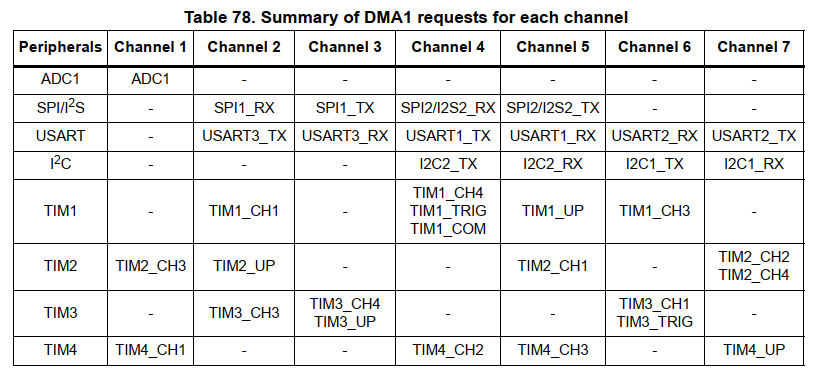

#DMA library

[DMA Introduction](#dma-introduction)
[Higher level: DMA class with default initializations](#higher-level-dma-class-with-default-initializations)
[Middle level: custom DMA class](#middle-level-custom-dma-class)
[Lower level: non-class DMA functions](#lower-level-non-class-dma-functions)
## DMA introduction

Direct Memory Access provides data transfers between memory locations and peripherals (in different combinations) without any CPU actions. Such transfers can be started and controlled by the code, using timers or the affected peripheral requests. The DMA library provides the tools for the DMA use.

There are three abstraction levels in this library:

1) **Higher level**: the `dma` class can be bound to two objects (peripheral and a memory array), one as a source and the other as a destination, sets the needed registers according to these objects, then starts the transfer as requested. Each provided pair has it's own overloaded initialization function.
2) **Middle level**: the same `dma` class has a custom initialization function that allows setting up any non-provided pair of objects but requires some understanding of the DMA workings.
3) **Lower level**: includes standalone functions for DMA setup and use.

Each DMA of STM32F103 (only one on Blue Pill) has 7 channels; each peripheral is bound to a certain channel. Here's a summary from the Reference Manual:



Each DMA channel can be set up independently, but it's a bad idea to use different peripherals tied to the same channel (e.g. SPI1_TX and USART3_RX) *as active DMA request sources* at the same time. This applies to timer-controlled channels too. Memory-to-memory transfers should be done on an unused channel.

Generally it is possible to sort the DMA peripherals so that each request source has its own channel. In the rare cases that's not so, you can either use the `init()` function of the `dma` class to re-initialize the DMA channel before each transfer, or use the `DMAenable/DMAdisable` functions of the peripheral classes (note that this will work only if the direction of the transfer is the same; if not use `init()`).

While there are seven DMA channels, only one DMA request is handled at any given time by each DMA unit. Thus there are priority levels to sort this out; if a higher priority DMA request happens while a lower priority one is being processed, the lower transfer will be paused and the higher one will start. These levels can be set to *very high*, *high*, *medium* and *low* manually. In case of the same manual priority, the channel with the lowest number gets priority.

## Higher level: DMA class with default initializations

**Note: the DMA peripheral clock must be enabled with `dma1_init()` prior to use.**

The `dma` class is designed to connect two objects via DMA. The object may have DMA capabilities or not; they can be peripheral classes from other files of this library or pointers to arrays. The DMA transfer itself is controlled by either one of the objects or by timers. The exact pair of the objects is defined in the initialization of the `dma` object (`init()`).

There are two **constructors** for a `dma` class object:

* **dma**: the default counstructor just creates an object; the exact channel and the source of the DMA request will be declared later in the `init()` function.

* **dma (uint8_t tmr)**: this constructor creates a DMA object that will use a timer event specified by `tmr` as the request source. The actual data source and target objects are still declared during initialization, but they won't control the transfer. Possible `tmr` values are:

define macro | value | meaning
--|--|--
DMA_TIM1_CH1	| 0x12 | Timer1 capture/compare channel 1 event
DMA_TIM1_CH4	| 0x14 | Timer1 capture/compare channel 2 event
DMA_TIM1_TRIG	| 0x1C | Timer1 trigger*
DMA_TIM1_COM	| 0x10 | Timer1 COM event
DMA_TIM1_UP		| 0x15 | Timer1 update event
DMA_TIM1_CH3	| 0x16 | Timer1 capture/compare channel 3 event
DMA_TIM2_CH3	| 0x21 | Timer2 capture/compare channel 3 event
DMA_TIM2_UP		| 0x22 | Timer2 update event
DMA_TIM2_CH1	| 0x25 | Timer2 capture/compare channel 1 event
DMA_TIM2_CH2	| 0x27 | Timer2 capture/compare channel 2 event
DMA_TIM2_CH4	| 0x2F | Timer2 capture/compare channel 4 event
DMA_TIM3_CH3	| 0x32 | Timer3 capture/compare channel 3 event
DMA_TIM3_CH4	| 0x33 | Timer3 capture/compare channel 4 event
DMA_TIM3_UP		| 0x3B | Timer3 update event
DMA_TIM3_CH1	| 0x36 | Timer3 capture/compare channel 1 event
DMA_TIM3_TRIG	| 0x3E | Timer3 trigger*
DMA_TIM4_CH1	| 0x41 | Timer4 capture/compare channel 1 event
DMA_TIM4_CH2	| 0x44 | Timer4 capture/compare channel 2 event
DMA_TIM4_CH3	| 0x45 | Timer4 capture/compare channel 3 event
DMA_TIM4_UP		| 0x47 | Timer4 update event
*\*Same as TRGO, see timers master mode*

* void **init (source, target [, uint8_t pri = DMA_PLHIGH])**

A `dma` object is initialized with `init` function. There are 38 initializers at the moment, most of them following the form above. `source` and `target` can be either a peripheral object or a pointer to an array (an array name); `pri` sets the priority if needed (default is high, check the possible values [below](#middle-level-custom-dma-class)).

The following object pairs can be used; the `<-->` arrows show the possible transfer direction:

* `spi1_slave <--> uint8_t*`
* `spi1_slave <--> uint16_t*`
* `spi2_slave <--> uint8_t*`
* `spi2_slave <--> uint16_t*`
* `i2c1_slave <--> uint8_t*`
* `i2c2_slave <--> uint8_t*`
* `usart1 <--> uint8_t*`
* `usart2 <--> uint8_t*`
* `usart3 <--> uint8_t*`
* `analog_cont --> uint16_t*`
* `analog_cont, analog_cont --> uint32_t*` [1]
* `uint16_t* --> tim1_pwm` [2]
* `uint16_t* --> tim2_pwm` [2]
* `uint16_t* --> tim3_pwm` [2]
* `uint16_t* --> tim4_pwm` [2]
* `uint16_t* --> timer1` [3]
* `uint16_t* --> timer2` [3]
* `uint16_t* --> timer3` [3]
* `uint16_t* --> timer4` [3]
* `uint16_t* --> gpioA` [4]
* `uint16_t* --> gpioB` [4]
* `uint16_t* --> gpioC` [4]
* `uint32_t* --> gpioA` [5]
* `uint32_t* --> gpioB` [5]
* `uint32_t* --> gpioC` [5]
* `uint8_t <--> uint8_t`
* `uint16_t <--> uint16_t`
* `uint32_t <--> uint32_t`


[1] This `init` takes two source `analog_cont` objects, ADC1 and ADC2. The reading is transferred as a 32-bit word, where the most significant 16 bits contain ADC2 data and least significant 16 bits contain ADC1 data.

[2] `void init(uint16_t* src, tim1_pwm targ [, uint8_t uedma = 0, uint16_t pri = DMA_PLVHIGH])`, where `uedma` specifies the request source: `0`(default) for compare event, `1` for update event.

[3] `void init(uint16_t* src, timer1 targ [, uint8_t numofch = 4, uint16_t pri = DMA_PLVHIGH])`, where `numofch` specifies the number of transfers in one burst (1 to 4). This `dma` object will fill the timer's capture/compare channel values on each update event, up to four channels.

[4] Writes 16-bit data into the port output, overwriting anything present there (i.e. all 16 outputs change their value according to the data received).

[5] Writes 32-bit data into the port bit set/reset register; 16 upper bits for set to 1, 16 lower bits for reset to 0; the setting and resetting is achieved by writing `1` to the corresponding bit (e.g. 0x00010000 will reset pin 0; 0x00000001 will set pin 0). This allows other GPIO pins not to be affected by the DMA transfers by keeping both their bits at 0.

Once the `dma` object is set up and initialized, the following functions can be used to do the actual data transfers:

* void **transfer ([uint16_t num = 1])**

Do one transfer, then stop. Optional `num` argument specifies the number of data to be transferred (0 to 65535, default 1).

* void **start([uint16_t num = 1])**

Start continuous (circular) transfer. Optional `num` argument specifies the number of data to be transferred before starting over. Circular mode is not available for memory-to-memory transfers.

* void **stop()**

Stop circular transfer and disable the DMA channel for the time being.

Additional functions can be used to trim the `dma` object behaviour and set up interrupts:

* void **disable()** - Disable DMA channel of this object.
* void **priority (uint16_t pri)** - Set DMA priority for this object. The possible defined values are: `DMA_PLVHIGH`, `DMA_PLHIGH`, `DMA_PLMEDIUM`, `DMA_PLLOW`.
* void **reset()** - Reset the `dma` object to default values (clear everything set up by `init()`).
* void **IRQenable()** - Enable DMA interrupts in the ARM core.
* void **IRQdisable()** - Disable DMA interrupts in the ARM core.
* void **enableError()** - Enable Transfer error interrupt.
* void **enableHalf()** - Enable Half transfer interrupt.
* void **enableComplete()** - Enable Transfer complete interrupt.
* void **disableError()** - Disable Transfer error interrupt.
* void **disableHalf()** - Disable Half transfer interrupt.
* void **disableComplete()** - Disable Transfer complete interrupt.
* uint8_t **interrupt(uint8_t channel)** - Returns 1 if the Global interrupt flag is set (any interrupt has hapened).
* uint8_t **complete(uint8_t channel)** - Returns 1 if the Transfer complete interrupt flag is set.
* uint8_t **half(uint8_t channel)** - Returns 1 if the Half transfer interrupt flag is set.
* uint8_t **error(uint8_t channel)** - Returns 1 if the Transfer error interrupt flag is set.
* void **clearError()** - Clear the Transfer error interrupt flag.
* void **clearHalf()** - Clear the Half transfer interrupt flag.
* void **clearComplete()** - Clear the Transfer complete interrupt flag.
* void **clearAll()** - Clear all interrupt flags.

## Middle level: custom DMA class

The custom DMA class is initialized with a special `init()` member function:

* void **init (uint8_t channel, uint32_t paddr, uint32_t maddr, uint16_t ccr)**

`channel` stands for channel number, `paddr` for peripheral address, `maddr` for memory address and `ccr` provides the contents of the DMA channel configuration register. The following values can be used in `ccr` (using 'or' to combine):
\# | macro name | meaning
---|---|----
1 | PER2MEM | Read from peripheral, circular mode disabled
&nbsp; | MEM2PER | Read from memory, circular mode disabled
&nbsp; | MEM2MEM | Memory to memory transfer*
&nbsp; | PER2MEM_CIRC | Read from peripheral, circular mode
&nbsp; | MEM2PER_CIRC |	Read from memory, circular mode
|
2 | DMA_PLLOW		|	Low priority level
&nbsp; | DMA_PLMEDIUM	|	Medium priority level
&nbsp;| DMA_PLHIGH	|	High priority level
&nbsp; | DMA_PLVHIGH	|	Very high priority level
| 
3 | PSIZE8		|	Peripheral size 8-bits (byte), increment mode disabled
&nbsp; | PSIZE16		|	Peripheral size 16-bits (half-word), increment mode disabled
&nbsp; | PSIZE32		|	Peripheral size 32-bits (word), increment mode disabled
&nbsp; | PSIZE8_INCR	|	Peripheral size 8-bits (byte), increment mode
&nbsp; | PSIZE16_INCR	| Peripheral size 16-bits (half-word), increment mode 
&nbsp; | PSIZE32_INCR	| Peripheral size 32-bits (word), increment mode 
 | 
4 | MSIZE8		|	Memory size 8-bits (byte), increment mode disabled
&nbsp; | MSIZE16		|	Memory size 16-bits (half-word), increment mode disabled
&nbsp; | MSIZE32		|	Memory size 32-bits (word), increment mode disabled
&nbsp; | MSIZE8_INCR	|	Memory size 8-bits (byte), increment mode
&nbsp; | MSIZE16_INCR	| Memory size 16-bits (half-word), increment mode 
&nbsp; | MSIZE32_INCR	| Memory size 32-bits (word), increment mode 
|
5 | DMA_COMPLETE | Transfer complete interrupt enable
&nbsp; | DMA_HALF | Half transfer interrupt enable
&nbsp; | DMA_HALF_COMPLETE | Half and complete transfer interrupt enable
&nbsp; | DMA_ERROR | Transfer error interrupt enable**
*\*Circular mode can not be used with mem2mem (p. 279 of Ref Man)*
*\*\*Error interrupt can be added to any of the other interrupts*

As an example, to initialize a `dma` object `m2u3` for USART3_TX transfer from an array `arr`, the following can be used:

```cpp
`m2u3.init(2, //channel
           0x40004804, // peripheral address for USART3 data register
           (uint32_t)arr, // address of the array in memory
           MEM2PER | // memory to peripheral
           DMA_PLHIGH | // priority level
           PSIZE8 | // peripheral data size is byte
           MSIZE8_INCR | // memory data size byte, increment mode
           DMA_COMPLETE); // enable Transfer complete interrupt 
```

*Note that `IRQenable(channel)` must also be used separately to enable interrupts*

After the custom initialization, the object can be used as a regular `dma` object (see above).

## Lower level: non-class DMA functions

Only DMA1 functions are present in the library at the moment, as the Blue Pill doesn't have DMA2. Future DMA2 functions will follow the same pattern.

DMA enable function:

* void **dma1_init()** - enable DMA clock

General functions:

* void **dma1_setup(uint8_t channel, uint32_t paddr, uint32_t maddr, uint16_t datanum, uint16_t ccr)** - setup DMA `channel`, `datanum` corresponds to the number of data to be transferred, `ccr` is the channel configuration register, see the table above.
* void **dma1_reset(uint8_t channel, uint16_t ccr = 0)** - reset the `channel` to default values or to the `ccr` values if provided.
* void **dma1_paddr(uint8_t channel, uint32_t paddr)** - set peripheral address
* void **dma1_maddr(uint8_t channel, uint32_t maddr)** - set memory address
* void **dma1_datanum(uint8_t channel, uint16_t datanum)** - set the number of data
* void **dma1_enable(uint8_t channel)**
* void **dma1_disable(uint8_t channel)**

DMA interrupts:

* void **dma1_IRQenable(uint8_t channel)** - enable global DMA interrupts for the `channel`
* void **dma1_IRQdisable(uint8_t channel)**
* void **dma1_errorenable(uint8_t channel)** - enable/disable particular interrupts
* void **dma1_halfenable(uint8_t channel)**
* void **dma1_completeenable(uint8_t channel)**
* void **dma1_errordisable(uint8_t channel)**
* void **dma1_halfdisable(uint8_t channel)**
* void **dma1_completedisable(uint8_t channel)**
* uint8_t **dma1_globalinterrupt(uint8_t channel)** - check the global interrupt flag
* uint8_t **dma1_transfercomplete(uint8_t channel)** - check a particular interrupt flag
* uint8_t **dma1_halftransfer(uint8_t channel)**
* uint8_t **dma1_transfererror(uint8_t channel)**
* void **dma1_ifclear(uint8_t channel)** - clear all interrupt flags
* void **dma1_completeclear(uint8_t channel)** - clear a particular interrupt flag
* void **dma1_halfclear(uint8_t channel)**
* void **dma1_errorclear(uint8_t channel)**


